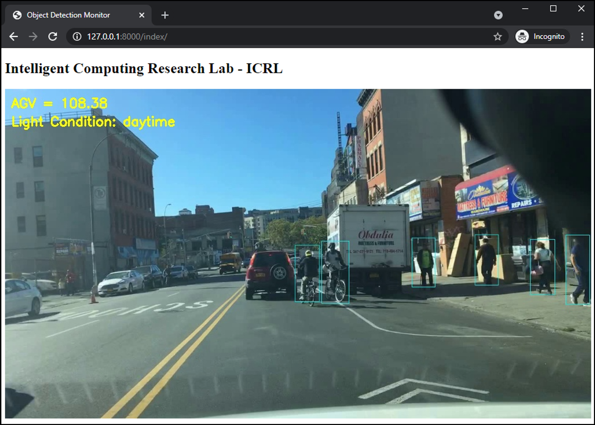

# Robustness Enhancement for Object Detection in Advanced Driver Assistance Systems (ADAS)

This is the implementation of the paper "Robustness Enhancement for Object Detection in Advanced Driver Assistance Systems (ADAS)"
in 2021 International Conference on System Science and Engineering (ICSSE2021)

Paper link: will be updated soon

## Result


## Dependencies
- Python 3.6+
- OpenCV
- Tensorflow 1.X
- Pyenv (optional)

## Train
```bashrc
$ python train.py
```

## Test
```bashrc
$ python test.py
```

## Output
File format: {image_name}.txt [ class_name confidence x1 y1 x2 y2 ]
```bashrc
person 0.980528 194 356 466 513
person 0.897605 752 372 975 467
person 0.414176 580 372 646 416
```

## References
- https://github.com/YunYang1994/tensorflow-yolov3
- https://github.com/tranleanh/yolov3-django-streaming

April 2021

Tran Le Anh
